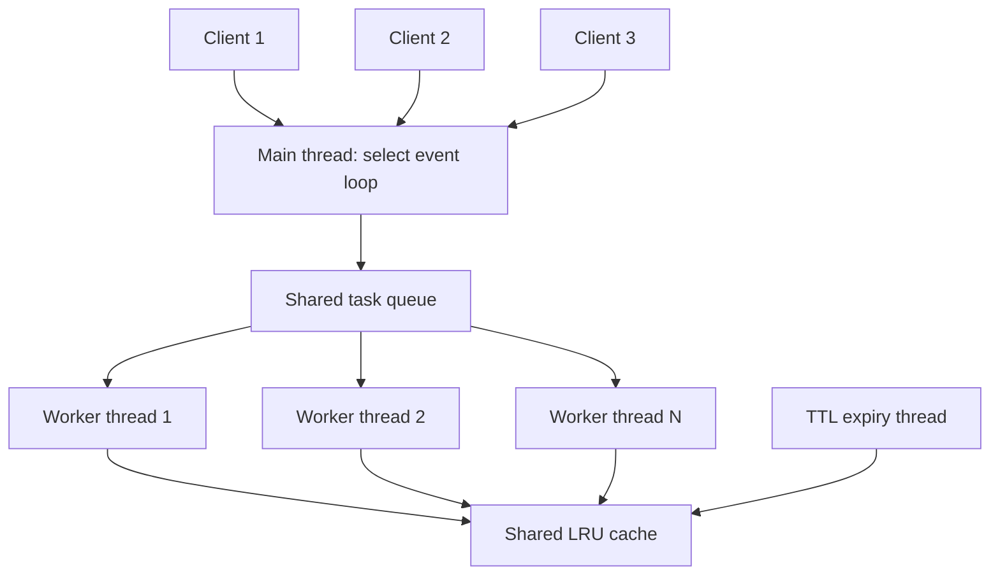

# Mini-Redis: Zero To One Guide

This guide assumes you are starting from zero. Read it first. By the end, you should know what this project is, what every supported command does, why it uses threads, what LRU means, and how the pieces work together.

## 1. Start With The Big Picture

### What is data?

Data is information a program wants to remember. For example:

```text
username = Ada
theme    = dark
cart     = 3-items
```

### What is a key-value store?

A **key** is a name used to find something. A **value** is the information stored under that name. A key-value store is like a small dictionary:

| Key | Value |
| --- | --- |
| `username` | `Ada` |
| `theme` | `dark` |
| `cart` | `3-items` |

This project stores only text keys and text values. Its main job is simple: store a value under a key, then quickly retrieve or remove it later.

### What is a database?

A database is a program that manages data. Many databases save data on a disk, so it stays after the program stops. Mini-Redis is an **in-memory database**, which means it keeps data in RAM (the computer's working memory).

RAM is fast, but temporary. If Mini-Redis stops or the computer restarts, all stored keys disappear because this project does not write data to a file or disk.

### What is Redis?

Redis is a well-known, production-grade in-memory data store used for caching, sessions, queues, counters, and more. It supports many kinds of data and many commands.

**Mini-Redis is not the real Redis.** It is a learning project inspired by Redis. It implements a small set of string-key commands and a few important systems-programming ideas: TCP networking, concurrency, LRU eviction, and expiration.

## 2. What This Program Can And Cannot Do

### It can

- Store one-word text values under one-word text keys.
- Read a stored value.
- Check if a key exists.
- Delete a key.
- Automatically remove a key after a time limit.
- Automatically evict old, unused entries when the cache is full.
- Handle several client requests concurrently using worker threads.

### It cannot

- Save data after restart.
- Store a key or value containing spaces.
- Keep one client connection open for several commands.
- List all keys.
- Increment numbers, use lists/sets/hashes, publish messages, authenticate clients, or encrypt network traffic.
- Speak the complete real Redis protocol.

Those are scope limits, not things you should pretend the project supports.

## 3. How A Client Talks To The Server

Think of Mini-Redis as a restaurant:

- The **server** is the kitchen that waits for orders.
- A **client** is a customer program that sends an order.
- A **command** is the order, such as `GET username`.
- A **response** is the kitchen's answer, such as `$Ada`.

The client and server communicate through **TCP**, a network connection. The server runs on a port, which is like a numbered doorway on a computer. The default port is `6379`.

For this project, the rules are:

1. The client opens one TCP connection.
2. The client sends one command ending in a newline.
3. The server sends one response.
4. The server closes the connection.

The command words are case-insensitive: `get name`, `Get name`, and `GET name` all work.

### Important words in a command

In this command:

```text
SET username Ada
```

- `SET` is the **command name**.
- `username` is the first **argument**, used as the key.
- `Ada` is the second argument, used as the value.

The parser splits commands at whitespace. Therefore this does **not** store `Ada Lovelace` as one value:

```text
SET username Ada Lovelace
```

It only uses `Ada` as the value and extra words are not part of that value. Use values without spaces in the current implementation, for example `Ada_Lovelace`.

## 4. Every Command You Can Run

These are all commands currently implemented in `Server::dispatch()`.

## `PING`

### What it means

`PING` asks: "Are you alive and responding?" It does not read or change the cache.

### Example

```text
Request:   PING
Response:  +PONG
```

The leading `+` means a simple successful text response in this project's Redis-inspired response format.

### Why it is useful

Use it as a health check before benchmarking or connecting an application. The Python stress client uses it first.

## `SET key value`

### What it means

`SET` stores a value under a key. If that key already exists, the new value replaces the old one.

### Examples

```text
Request:   SET username Ada
Response:  +OK

Request:   GET username
Response:  $Ada

Request:   SET username Grace
Response:  +OK

Request:   GET username
Response:  $Grace
```

### What the code does

1. It checks that at least a key and a value were supplied.
2. It calls `LRUCache::set(key, value, ttl_ms)`.
3. If the key exists, it updates the value and marks that key as recently used.
4. If it is a new key and the cache is full, it evicts the least recently used key first.
5. It stores the new entry and responds `+OK`.

## `SET key value EX milliseconds`

### What it means

This is `SET` with a **TTL**, or time to live. The key expires after the requested number of milliseconds.

```text
Request:   SET login-token abc123 EX 5000
Response:  +OK
```

Here, `5000` milliseconds equals 5 seconds. Before 5 seconds pass, `GET login-token` returns `$abc123`. After it expires, it returns `$-1`.

### Important warning

In the real Redis server, `EX 5` means 5 seconds. In **this** project, `EX 5000` means 5,000 milliseconds. The code calls the value `ttl_ms`, and the parser documentation says milliseconds.

### What happens after expiry?

The key is removed in either of two ways:

- A `GET` or `EXISTS` sees that it has expired and deletes it immediately.
- The background expiry thread wakes roughly every 500 milliseconds and removes expired entries even when nobody asks for them.

## `GET key`

### What it means

`GET` retrieves the value currently stored under a key.

```text
Request:   GET username
Response:  $Ada
```

The `$` prefix means "a string value follows." It is just part of this project's response format, not part of the value itself.

### Missing or expired key

```text
Request:   GET does-not-exist
Response:  $-1
```

`$-1` means no value was found. It can mean the key never existed, was deleted, expired, or was evicted by LRU.

### Why GET changes LRU order

Reading a key counts as using it. After a successful GET, the key becomes the most recently used entry. This prevents a frequently read key from being evicted before an older unused one.

## `DEL key`

### What it means

`DEL` removes a key immediately.

```text
Request:   SET color blue
Response:  +OK

Request:   DEL color
Response:  :1

Request:   GET color
Response:  $-1
```

`:1` means one key was removed. If there was no such key, it returns `:0`:

```text
Request:   DEL color
Response:  :0
```

The `:` prefix means an integer response.

## `EXISTS key`

### What it means

`EXISTS` checks whether a key is currently present.

```text
Request:   SET color blue
Response:  +OK

Request:   EXISTS color
Response:  :1

Request:   EXISTS missing
Response:  :0
```

Expired keys count as missing. `EXISTS` also removes a key if it discovers the key has expired.

## Errors

The server returns an error response starting with `-ERR` for unknown commands or commands missing a required argument.

```text
Request:   HELLO
Response:  -ERR unknown command 'HELLO'

Request:   GET
Response:  -ERR GET requires a key

Request:   SET only-a-key
Response:  -ERR SET requires key and value

Request:   SET token abc EX not-a-number
Response:  -ERR EX value must be an integer
```

Use the documented command forms exactly. The current dispatcher validates required arguments but does not strictly reject every extra or unsupported argument.

## 5. Try It Yourself

First compile and start the server from the repository root:

```powershell
g++ -std=c++17 main.cpp server.cpp command_parser.cpp thread_pool.cpp lru_cache.cpp -o mini_redis -lws2_32 -pthread
.\mini_redis.exe
```

Open a second PowerShell window. The following small Python command sends one request, prints the response, and closes the connection, exactly like this server expects:

```powershell
python -c "import socket; s=socket.create_connection(('127.0.0.1', 6379)); s.sendall(b'PING\r\n'); print(s.recv(1024).decode().strip()); s.close()"
```

Change `PING` to any command below and run it again. Each command must run in a separate call because Mini-Redis closes each connection after responding.

```text
SET language Cpp
GET language
EXISTS language
DEL language
GET language
SET temporary value EX 2000
```

Expected sequence:

```text
+OK
$Cpp
:1
:1
$-1
+OK
```

After about two seconds, `GET temporary` should return `$-1`.

## 6. What Is A Cache?

A **cache** is a limited, fast storage area that keeps data likely to be needed again. The aim is speed, not permanent storage.

Imagine a small desk with room for only three papers. The papers used most often should stay on the desk; old papers can be removed to make room. Mini-Redis uses this same idea for keys in memory.

The configured cache capacity is the maximum number of keys, not a maximum number of bytes. For example:

```powershell
.\mini_redis.exe 6379 3 4
```

means port 6379, capacity of 3 keys, and 4 worker threads.

## 7. What Does LRU Mean?

**LRU** means **Least Recently Used**. When the cache is full and a new key must be inserted, LRU removes the key that has gone unused for the longest time.

### A small example

Assume capacity is three keys.

```text
SET a 1        Current order: a
SET b 2        Current order: b, a
SET c 3        Current order: c, b, a
GET a          Current order: a, c, b
SET d 4        Cache was full, so b is removed
               Current order: d, a, c
```

The left side is most recently used. The right side is least recently used. `b` was removed because `a` was read recently, while `b` was not.

### How the code implements LRU

The cache uses two data structures at once:

```text
map_ (unordered map)
"a" -> iterator pointing to the "a" list node
"c" -> iterator pointing to the "c" list node
"d" -> iterator pointing to the "d" list node

usage_list_ (doubly linked list)
front / newest                         back / oldest
[d, 4] <-> [a, 1] <-> [c, 3]
```

### Why two structures?

An **unordered map** is a fast lookup table. Given key `a`, it finds `a` quickly, on average in O(1) time. But it does not remember which key was used last.

A **doubly linked list** is a chain of nodes where each node can point to the one before and after it. It keeps usage order. Given the node, the code can move or delete it quickly. But a list alone would have to scan from the beginning to find a named key.

Together they solve both problems:

- The map finds the list node for a key.
- The list remembers newest-to-oldest usage order.
- The map stores a list **iterator**, which is like a precise bookmark to that node.
- `splice()` moves a node to the front without copying the node.
- The back node is always the LRU victim when capacity is full.

### The rule that keeps the structures correct

Every live key must appear **once in both structures**:

```text
map_[key]  -> iterator to the one usage_list_ node whose first field is key
```

For example, after the earlier `SET d 4`, the cache has this relationship:

```text
map_                              usage_list_
"d" -> bookmark ----------------> [d, 4] <-> [a, 1] <-> [c, 3]
"a" -> bookmark --------------------------------^ 
"c" -> bookmark ------------------------------------------------^
                                    front / MRU          back / LRU
```

The arrows are conceptual: the map stores C++ list iterators, not literal arrows. The important invariant is that no key is left in only one structure. When the cache adds a key, it adds both the list node and its map entry. When it deletes a key, it removes both. This is why the methods take one mutex before changing either structure: another thread must never observe a half-finished update.

### What happens on `GET`

Suppose the current order is `d, a, c`, where `d` is newest and `c` is oldest. A client asks for `GET a`.

1. `get()` looks up `"a"` in `map_`. This quickly produces the iterator for the existing `[a, 1]` node.
2. It checks whether that entry's TTL has expired. If it has, `get()` erases the list node and map entry, then returns no value.
3. If it is still live, `usage_list_.splice(usage_list_.begin(), usage_list_, list_it)` moves that **same node** to the front.
4. The map iterator remains valid because `std::list::splice` relinks the node instead of copying or destroying it.
5. `get()` returns the value.

```text
Before GET a:  [d, 4] <-> [a, 1] <-> [c, 3]
After GET a:   [a, 1] <-> [d, 4] <-> [c, 3]
                 newest                    oldest
```

This is why a successful `GET` is also a write to the LRU order. It changes which key will be evicted next, even though the stored value is unchanged. A missing or expired `GET` does not promote anything.

### What happens on `SET`

`set()` has two paths.

#### Updating an existing key

For `SET a 99`, the key is already in `map_`. The cache uses its iterator to find the existing list node, replaces that node's `CacheEntry` with the new value and TTL, then splices the node to the front. The total number of keys does not change, so no eviction is needed.

```text
Before SET a 99:  [d, 4] <-> [a, 1] <-> [c, 3]
After SET a 99:   [a, 99] <-> [d, 4] <-> [c, 3]
```

Updating counts as using the key. In particular, replacing an existing value never evicts another key, even when the cache is at capacity.

#### Inserting a new key

For a new key, `set()` first checks whether the list size has reached `capacity_`.

- If there is room, it inserts a `[key, entry]` node at the front and stores an iterator to that new front node in `map_`.
- If the cache is full, it calls `evict_lru_locked()` first. That helper reads the key from the back node, erases that key from `map_`, and then erases the back node from `usage_list_`. The new key is then inserted at the front.

For capacity three:

```text
Before SET e 5:  [a, 99] <-> [d, 4] <-> [c, 3]
                                     ^ c is the LRU victim

Remove c:        [a, 99] <-> [d, 4]
Insert e:        [e, 5] <-> [a, 99] <-> [d, 4]
```

The cache removes the map entry before removing its list node because it needs that node's key to locate the corresponding map entry. After the list node is erased, its iterator must no longer be used.

### What happens on deletion and expiration

`DEL key` looks up the key in `map_`, erases the pointed-to list node, then erases the map entry. TTL cleanup uses the same paired deletion:

- `GET` and `EXISTS` perform **lazy expiry**. If they encounter an expired entry, they remove it immediately instead of returning stale data.
- `evict_expired()` performs **active expiry**. It periodically scans every list node, collects expired keys, and then removes each key from both structures.

Expiration frees capacity. An expired key that is removed before an insertion is no longer an LRU candidate, because it is no longer in the cache at all.

### Why these operations are fast

| Operation | Main work | Typical complexity |
| --- | --- | --- |
| `GET` live key | Map lookup, TTL check, `splice` | Average O(1) |
| `SET` existing key | Map lookup, replace entry, `splice` | Average O(1) |
| `SET` new key at capacity | Remove list back node and matching map entry, then insert | Average O(1) |
| `DEL` | Map lookup and erase through stored iterator | Average O(1) |
| Background TTL sweep | Inspect every list node | O(n) |

`unordered_map` operations are described as **average** O(1), rather than guaranteed O(1), because unusually bad hash collisions can make a lookup slower. The normal cache operations avoid scanning the whole list; only the periodic expiry sweep deliberately visits every entry.

## 8. What Is A Thread?

A running program is a **process**. A **thread** is one path of work inside that process. A program can have multiple threads working at roughly the same time.

In a restaurant analogy:

- The program is the restaurant.
- A thread is one worker in the restaurant.
- Work is an order to prepare.

More threads can allow several requests to make progress at once. But they also create a danger: two threads might try to change the same data at the same moment.

## 9. What Is Multithreading In This Project?

Mini-Redis has these kinds of threads:

| Thread role | How many? | Job |
| --- | --- | --- |
| Main/event-loop thread | One | Wait for network activity, accept clients, queue client work. |
| Worker threads | Configured count, default four | Read a client command, dispatch it, send response, close connection. |
| TTL expiry thread | One | Wake every 500 ms and remove expired keys. |

The event loop itself runs in the thread that calls `Server::run()`, which is the main thread in this program.



## 10. What Is A Thread Pool?

A **thread pool** is a fixed group of worker threads that waits for jobs in a shared queue.

Without a thread pool, a simple server might create a brand-new thread for every client connection. That is wasteful: creating and destroying operating-system threads costs time and memory, and a flood of clients could create too many threads.

With this project's thread pool:

1. The `ThreadPool` constructor creates the configured number of workers once.
2. Every worker waits for a task in `task_queue_`.
3. The event loop accepts a ready client and calls `pool_.enqueue(...)`.
4. `enqueue` puts a small function, or task, into the queue and wakes one sleeping worker.
5. One worker removes that task and runs `handle_client(client_fd)`.
6. After it handles that one connection, the worker goes back to waiting for another task.

This is reuse: four workers can handle many thousands of connections over time without being created again for each request.

### The actual structures used

| Code item | Plain meaning |
| --- | --- |
| `std::vector<std::thread> workers_` | The group of worker threads. |
| `std::queue<std::function<void()>> task_queue_` | A first-in-first-out line of pending jobs. |
| `queue_mutex_` | A lock protecting the queue from two workers changing it at once. |
| `condition_` | A notification system allowing workers to sleep until a task arrives. |
| `stop_` | An atomic shutdown flag. |

### What happens inside one worker

Each worker runs a loop similar to this:

```text
forever:
    lock the task queue
    sleep until a task arrives or shutdown starts
    if shutdown and no queued work remains: exit
    remove the next task from the queue
    unlock the queue
    run the task
```

It runs the task **after unlocking the queue**. This is important: if it kept the queue lock while processing a slow network request, no other worker could take another task.

### What is a condition variable?

A condition variable lets a thread sleep until another thread tells it that something changed. Here, idle workers sleep rather than repeatedly checking the queue and wasting CPU. When `enqueue()` adds a task, `notify_one()` wakes one worker.

## 11. What Is A Race Condition And How Does The Project Avoid It?

Imagine two workers both changing the same cache at the same instant. One might remove a key from the map while the other tries to move the same key in the list. This timing-dependent bug is a **race condition**.

A **mutex** is a lock that allows only one thread at a time into a protected section. `LRUCache` uses `mutex_` to protect both `map_` and `usage_list_`.

```text
Worker A: lock cache -> update map and list -> unlock cache
Worker B: waits        -> lock cache          -> update safely
```

`std::lock_guard` manages this lock automatically. When the method returns, including an early return, the lock guard goes out of scope and unlocks the mutex.

The trade-off is simple and safe code, but only one cache operation can modify or inspect the protected structures at a time. That can become a bottleneck at very high load.

## 12. What Is TTL?

**TTL** means **time to live**. It is a countdown for a key.

```text
SET verification-code 8123 EX 60000
```

This keeps the code for 60,000 milliseconds, or 60 seconds. After that, it should no longer be usable.

The code stores an expiry timestamp inside `CacheEntry`. It uses `std::optional` because some keys have no expiry. `std::optional` means "there may be a value, or there may be no value." Here:

```text
expires_at has a time  -> this key expires
expires_at is empty    -> this key does not expire
```

## 13. What Is An Atomic Flag?

An **atomic** value is safe for simple shared reads and writes between threads. This project uses `std::atomic<bool>` for flags such as `running_` and `stop_`.

For example, when Ctrl+C is pressed, `Server::stop()` sets `running_` to false. The event loop and TTL thread can safely read that flag and end their loops.

An atomic flag is not enough to protect the complex cache structures; that is why the cache also needs a mutex.

## 14. What Happens From Start To Finish?

Here is the whole journey for a request:

1. `main.cpp` starts the server with a port, cache capacity, and worker count.
2. `Server` initializes Windows networking with Winsock and creates the cache and thread pool.
3. `Server::run()` creates a listening TCP socket and starts the TTL thread.
4. The event loop calls `select()` to wait for a new connection or incoming client data.
5. When a client sends a newline-terminated command, the event loop adds `handle_client` to the worker task queue.
6. A worker thread reads the command and calls `CommandParser::parse()`.
7. `dispatch()` chooses the code for PING, SET, GET, DEL, or EXISTS.
8. The cache performs the operation under its mutex.
9. The worker sends the response and closes that client connection.
10. Separately, the expiry thread periodically removes expired keys.

## 15. A Beginner Reading Plan

1. Finish this guide and run the command examples.
2. Read [01-project-introduction.md](01-project-introduction.md) for the concise overview.
3. Read [02-project-workflow.md](02-project-workflow.md) slowly with `server.cpp` open beside it.
4. Read [03-code-walkthrough.md](03-code-walkthrough.md) with each listed source file open.
5. Read [04-concepts-explained.md](04-concepts-explained.md) for more precise definitions and trade-offs.
6. Run `test_lru_cache.cpp` and then `stress_client.py`.
7. Use [05-interview-cheat-sheet.md](05-interview-cheat-sheet.md) to practise answers aloud.

## 16. The Most Important Truths To Remember

- This is a small, in-memory, Redis-inspired key-value server.
- It only implements `PING`, `SET`, `GET`, `DEL`, and `EXISTS`.
- It accepts one newline-terminated command per TCP connection.
- A thread pool reuses a fixed number of workers to handle client tasks.
- A mutex prevents multiple threads from corrupting the shared cache.
- LRU removes the least recently used key when the maximum key count is reached.
- TTL removes keys after a specified number of milliseconds.
- The project is a strong learning implementation, not a full production Redis replacement.