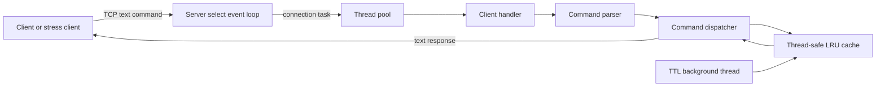

# Mini-Redis: Beginner Introduction

## What this project is

Mini-Redis is a small, in-memory key-value database written in C++17 for Windows. A client connects to the server over TCP, sends one text command, receives a response, and disconnects. The server stores values in RAM, so lookups are fast but data disappears when the program stops.

It is inspired by Redis, a popular in-memory data store, but it intentionally implements only a small custom protocol and a few commands. It is best described in an interview as a **multithreaded TCP key-value server with LRU eviction and TTL expiry**.

## The problem it solves

Applications often need to associate a short key with a value quickly:

```text
session:42 -> logged_in
theme      -> dark
```

Keeping these values in memory is much faster than reading them from a disk database. Because memory is limited, the project removes the item that has gone unused for the longest time when the configured cache capacity is full. It can also expire values after a requested period.

## What a user can do

Every request is one whitespace-separated command followed by `\r\n` (or `\n`). Commands are case-insensitive.

| Request | Meaning | Response example |
| --- | --- | --- |
| `PING` | Check whether the server is reachable. | `+PONG` |
| `SET name Ada` | Store `Ada` under `name`. | `+OK` |
| `GET name` | Read the value for `name`. | `$Ada` |
| `DEL name` | Delete `name`. | `:1` when deleted, `:0` when absent |
| `EXISTS name` | Check whether `name` exists and is not expired. | `:1` or `:0` |
| `SET token abc EX 5000` | Store `token` for 5,000 milliseconds. | `+OK` |

`$-1` means a requested key is absent or expired. Errors begin with `-ERR`.

Important protocol constraints:

- A connection supports **one command only**; the server sends one response and closes it.
- The parser splits on whitespace. Values and keys therefore cannot contain spaces.
- `EX` means milliseconds in this project, unlike real Redis where `EX` normally means seconds.
- This is a plain text protocol inspired by RESP response prefixes, not the full Redis RESP protocol.

## Main components



- **`main.cpp`** configures and starts the server.
- **`server.cpp`** owns networking, command dispatch, and TTL cleanup scheduling.
- **`command_parser.cpp`** turns raw text into a command name and arguments.
- **`thread_pool.cpp`** keeps a fixed number of reusable worker threads.
- **`lru_cache.cpp`** stores data, expires TTL entries, and evicts least-recently-used entries.
- **`stress_client.py`** is a concurrent Python benchmark client.
- **`test_lru_cache.cpp`** tests the cache directly without a testing framework.

## How to run it

Compile the server from the repository root with a C++17 compiler. On Windows, `-lws2_32` links the Winsock networking library.

```powershell
g++ -std=c++17 main.cpp server.cpp command_parser.cpp thread_pool.cpp lru_cache.cpp -o mini_redis -lws2_32 -pthread
.\mini_redis.exe
```

Optional command-line arguments are `[port] [cache_size] [threads]`:

```powershell
.\mini_redis.exe 6380 1000 8
```

In another terminal, run the stress client:

```powershell
python stress_client.py --requests 50000 --threads 16
```

## A 30-second interview answer

> I built a C++17 in-memory key-value server inspired by Redis. It accepts simple TCP commands such as SET, GET, DEL, and EXISTS. The event loop uses Windows `select()` to observe sockets, then hands each client connection to a fixed thread pool so networking does not create a new thread for every request. The storage layer combines an unordered map with a doubly linked list to provide average O(1) lookup and O(1) LRU eviction. A mutex protects the cache from concurrent workers, and TTL entries are removed lazily on access and proactively by a background sweeper thread.

New to all of these ideas? Start with [00-zero-to-one-guide.md](00-zero-to-one-guide.md). Then read [02-project-workflow.md](02-project-workflow.md) for the full path of a request, [03-code-walkthrough.md](03-code-walkthrough.md) for a file-by-file explanation, [04-concepts-explained.md](04-concepts-explained.md) for deeper theory, and [05-interview-cheat-sheet.md](05-interview-cheat-sheet.md) for final practice.