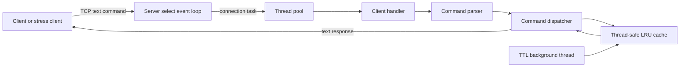

# Mini-Redis: Beginner Introduction

## What this project is

Mini-Redis is a small, in-memory key-value database written in C++17 for Windows. A client connects to the server over TCP, sends one text command, receives a response, and disconnects. The server stores values in RAM, so lookups are fast but data disappears when the program stops.

It is inspired by Redis, a popular in-memory data store, but it intentionally implements only a small custom protocol and a few commands. It is best described in an interview as a **multithreaded TCP key-value server with LRU eviction and TTL expiry**.

## The problem it solves

Applications often need to associate a short key with a value quickly:

```text
session:42 -> logged_in
theme      -> dark
```

Keeping these values in memory is much faster than reading them from a disk database. Because memory is limited, the project removes the item that has gone unused for the longest time when the configured cache capacity is full. It can also expire values after a requested period.

## What a user can do

Every request is one whitespace-separated command followed by `\r\n` (or `\n`). Commands are case-insensitive.

| Request | Meaning | Response example |
| --- | --- | --- |
| `PING` | Check whether the server is reachable. | `+PONG` |
| `SET name Ada` | Store `Ada` under `name`. | `+OK` |
| `GET name` | Read the value for `name`. | `$Ada` |
| `DEL name` | Delete `name`. | `:1` when deleted, `:0` when absent |
| `EXISTS name` | Check whether `name` exists and is not expired. | `:1` or `:0` |
| `SET token abc EX 5000` | Store `token` for 5,000 milliseconds. | `+OK` |

`$-1` means a requested key is absent or expired. Errors begin with `-ERR`.

Important protocol constraints:

- A connection supports **one command only**; the server sends one response and closes it.
- The parser splits on whitespace. Values and keys therefore cannot contain spaces.
- `EX` means milliseconds in this project, unlike real Redis where `EX` normally means seconds.
- This is a plain text protocol inspired by RESP response prefixes, not the full Redis RESP protocol.

## Main components



The components deliberately have separate jobs. Networking does not decide cache policy, the cache does not parse commands, and worker threads do not own the data. That separation makes each piece easier to understand and test.

### `main.cpp`: configuration and program lifetime

`main()` is the entry point. It chooses defaults of port `6379`, cache capacity `10000`, and four worker threads, then optionally replaces them with the command-line arguments:

```text
mini_redis [port] [cache_size] [threads]
```

It constructs one `Server` with those settings and calls `Server::run()`. It also registers Ctrl+C (`SIGINT`) and termination (`SIGTERM`) handlers. The handlers call `Server::stop()`, which changes the server's shared `running_` flag so the event loop can exit cleanly. `main()` does not accept sockets, parse commands, or store values; it starts and owns the object that does.

### `server.cpp`: network coordinator and command dispatcher

`Server` is the central coordinator. It owns one listening socket, one `LRUCache`, one `ThreadPool`, and the atomic `running_` flag. Its work divides into four responsibilities:

1. **Set up the TCP listener.** `setup_listener()` starts from a Windows Winsock socket, enables address reuse, puts the listening socket into non-blocking mode, binds it to the configured host and port, and begins listening for clients.
2. **Observe connections.** `run()` uses Windows `select()` with a 200 ms timeout. `select()` tells the server when the listening socket has a new connection or when an accepted client socket has data ready to read. The event loop does not wait for an individual client to send its whole request.
3. **Hand client work to the pool.** When a client socket becomes readable, `run()` removes it from its own set and enqueues `handle_client(fd)` as a task. A worker thread will read the request, dispatch it, send the response, and close that connection. This keeps the event loop available to observe more sockets.
4. **Turn parsed commands into cache calls.** `dispatch()` validates the command arguments and maps `PING`, `SET`, `GET`, `DEL`, and `EXISTS` to the appropriate cache method. It also chooses the protocol response, such as `+OK`, `$value`, `:1`, `$-1`, or `-ERR ...`.

`handle_client()` accumulates received bytes until it finds a newline. It dispatches only the first complete line, sends one response, and closes the socket. This is the concrete reason that one Mini-Redis connection supports one command only.

The server also starts `expiry_thread_fn()`. While the server is running, that background loop waits 500 ms and calls `cache_.evict_expired()`. It is a cleanup service: command processing remains responsible for its own cache calls, while the sweeper reclaims expired entries that nobody reads.

### `command_parser.cpp`: protocol text to structured input

The parser isolates the simple wire format from the rest of the server. It receives a raw request line such as:

```text
set profile Ada\r\n
```

It removes trailing `\r` and `\n`, splits the remaining text at whitespace, converts only the first token to uppercase, and returns a `ParsedCommand`:

```text
name: "SET"
args: ["profile", "Ada"]
```

`dispatch()` can therefore compare command names consistently without worrying about client capitalization: `set`, `Set`, and `SET` all become `SET`. Arguments remain unchanged, so a key or value's capitalization is preserved. An empty or whitespace-only request produces `std::nullopt`, which `dispatch()` turns into an error response.

Because parsing is whitespace based, it intentionally does not implement quoted strings, escaping, or the full Redis RESP protocol. For example, `SET name Ada Lovelace` supplies `Ada` as the value and leaves `Lovelace` as an extra argument.

### `thread_pool.cpp`: bounded, reusable request workers

The thread pool creates the configured number of worker threads once, at server construction. Each worker repeats the same cycle:

1. Lock the task queue and wait on a condition variable until a task is available or shutdown begins.
2. Remove one task from the FIFO queue.
3. Unlock the queue.
4. Run the task, such as `handle_client(fd)`, outside the queue lock.

`enqueue()` adds client tasks to the queue and wakes one waiting worker. Running the task after releasing `queue_mutex_` is important: other workers can immediately take later requests instead of waiting for the current client to finish.

The pool is **fixed-size**. Under heavy load, tasks wait in the queue once all workers are busy; the server does not create unlimited operating-system threads. On destruction, the pool marks itself as stopping, wakes all workers, and joins them after queued work has drained.

### `lru_cache.cpp`: shared storage, eviction, and TTL rules

`LRUCache` is the only component that owns key-value data. It exposes a small API used by `Server::dispatch()`:

| Method | Dispatcher use | Result |
| --- | --- | --- |
| `set(key, value, ttl_ms)` | `SET` | Inserts or updates a value, optionally with an expiry time. |
| `get(key)` | `GET` | Returns a value when it is present and live; otherwise no value. A successful read promotes the key to most recently used. |
| `del(key)` | `DEL` | Removes a key and reports whether it existed. |
| `exists(key)` | `EXISTS` | Reports whether a live key exists. |
| `evict_expired()` | Background sweeper | Removes all entries whose TTL has elapsed. |

Internally, the cache pairs an `unordered_map` with a doubly linked `std::list`. The map finds a key's list node in average O(1) time; the list records usage order, with the front as most recently used and the back as the eviction candidate. At capacity, a new key removes the node at the list back before insertion. The detailed walkthrough, including how list iterators keep the two structures synchronized, is in [00-zero-to-one-guide.md](00-zero-to-one-guide.md).

Several worker threads can reach this same cache at once. Each public cache operation locks one mutex before touching the map or list, so operations such as moving a recently read key or evicting an old key remain consistent.

TTL uses two complementary paths. `get()` and `exists()` perform **lazy expiry** by deleting an expired key when one is requested. The server's background sweeper performs **active expiry** by periodically deleting expired keys that clients are not currently requesting.

### `stress_client.py`: concurrent server exercise

This Python program is a client, not part of the server. It opens many TCP connections concurrently, sends `SET` and `GET` requests, checks replies, and reports throughput, latency, and errors. It is useful for demonstrating that the server can accept concurrent work and for spotting regressions in the complete networking path.

### `test_lru_cache.cpp`: focused cache checks

This executable tests `LRUCache` without TCP sockets, parsing, or the thread pool. Its small `CHECK` macro validates basic storage, LRU promotion and eviction, overwriting a key, deletion, existence, TTL expiration, size reporting, and concurrent cache calls. This narrow scope makes a cache failure easier to diagnose: it separates storage behavior from network behavior.

## How to run it

Compile the server from the repository root with a C++17 compiler. On Windows, `-lws2_32` links the Winsock networking library.

```powershell
g++ -std=c++17 main.cpp server.cpp command_parser.cpp thread_pool.cpp lru_cache.cpp -o mini_redis -lws2_32 -pthread
.\mini_redis.exe
```

Optional command-line arguments are `[port] [cache_size] [threads]`:

```powershell
.\mini_redis.exe 6380 1000 8
```

In another terminal, run the stress client:

```powershell
python stress_client.py --requests 50000 --threads 16
```

## A 30-second interview answer

> I built a C++17 in-memory key-value server inspired by Redis. It accepts simple TCP commands such as SET, GET, DEL, and EXISTS. The event loop uses Windows `select()` to observe sockets, then hands each client connection to a fixed thread pool so networking does not create a new thread for every request. The storage layer combines an unordered map with a doubly linked list to provide average O(1) lookup and O(1) LRU eviction. A mutex protects the cache from concurrent workers, and TTL entries are removed lazily on access and proactively by a background sweeper thread.

New to all of these ideas? Start with [00-zero-to-one-guide.md](00-zero-to-one-guide.md). Then read [02-project-workflow.md](02-project-workflow.md) for the full path of a request, [03-code-walkthrough.md](03-code-walkthrough.md) for a file-by-file explanation, [04-concepts-explained.md](04-concepts-explained.md) for deeper theory, and [05-interview-cheat-sheet.md](05-interview-cheat-sheet.md) for final practice.