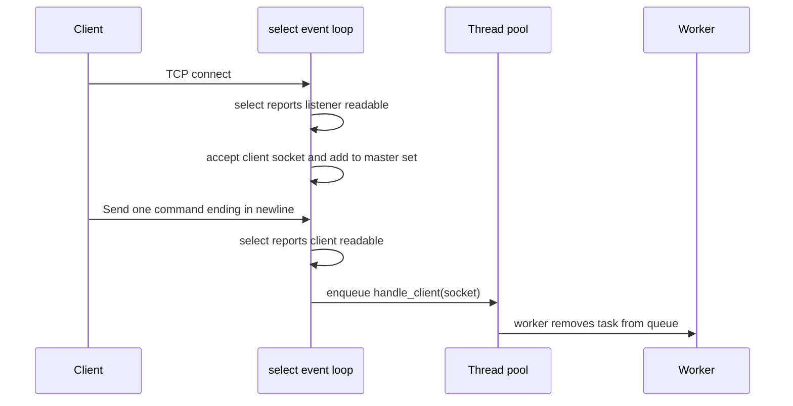
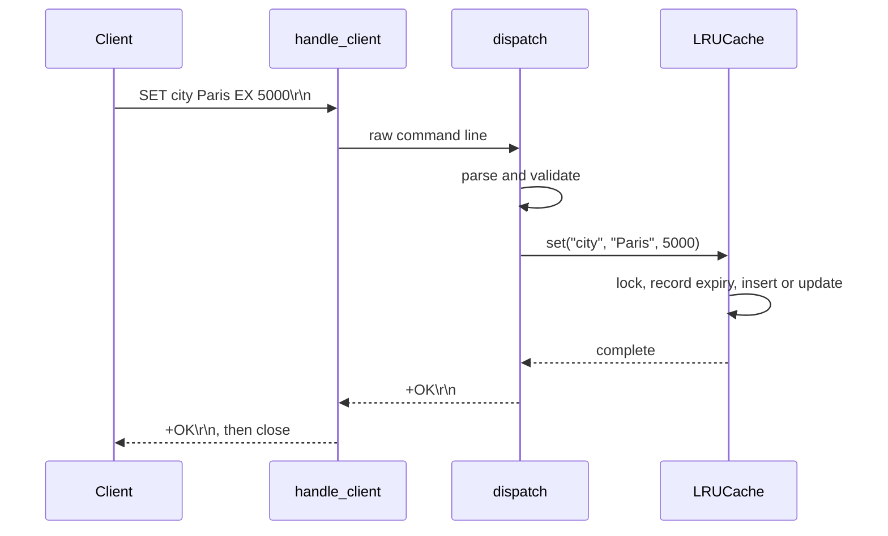

# Project Workflow

This document follows the server from startup through a single client request and shutdown.

## 1. Startup

1. `main()` chooses defaults: port `6379`, cache capacity `10000`, and four worker threads. Command-line arguments can replace them.
2. `main()` constructs `Server` with host `0.0.0.0`, meaning listen on every local network interface.
3. The `Server` constructor starts Winsock with `WSAStartup`, constructs an `LRUCache`, constructs a `ThreadPool`, and sets `running_` to false.
4. `main()` registers `SIGINT` and `SIGTERM` handlers. Pressing Ctrl+C calls `Server::stop()`, which changes the atomic `running_` flag to false.
5. `Server::run()` creates a TCP listening socket, enables address reuse, sets it non-blocking, binds it to the configured address and port, and starts listening.
6. `run()` starts a detached TTL-sweeper thread and enters the socket event loop.

## 2. Accepting a connection

The event loop maintains `master_set`, a Winsock `fd_set` containing the listening socket and accepted client sockets.

`select()` blocks for up to 200 milliseconds while waiting for activity. This avoids a busy loop that would continuously consume CPU. On Windows, its first argument is ignored, which is why the call uses `select(0, ...)`.

Before the task is queued, the event loop removes the client socket from `master_set`. That avoids scheduling the same socket more than once. A worker owns that connection afterward.

## 3. Reading, parsing, and dispatching a request

1. `handle_client()` calls `recv()` and appends bytes to `request_buf`.
2. It waits until it sees `\n`, allowing a command split across multiple TCP packets to be assembled.
3. It takes the first complete line and calls `dispatch()`.
4. `CommandParser::parse()` removes line endings, tokenizes on whitespace with `std::istringstream`, uppercases the first token, and returns `ParsedCommand { name, args }`.
5. `dispatch()` validates the argument count, calls the matching cache method, and formats a text response.
6. `handle_client()` repeatedly calls `send()` until the full response has been sent. It then closes the socket and returns. This makes the server explicitly one-command-per-connection.

### Example: `SET city Paris EX 5000`

### Command dispatch rules

| Command | Cache operation | Validation and behavior |
| --- | --- | --- |
| `PING` | None | Returns `+PONG`. |
| `SET key value [EX milliseconds]` | `set` | Requires key and value. `EX` is only applied when there are at least four arguments and argument 3 is `EX`. |
| `GET key` | `get` | Requires a key. Missing or expired keys return `$-1`. |
| `DEL key` | `del` | Requires a key. Returns whether deletion happened. |
| `EXISTS key` | `exists` | Requires a key. Expired keys count as absent. |

## 4. Cache workflow

### SET

1. Lock the cache mutex.
2. Build an entry containing the value and, when TTL is positive, a `steady_clock` expiry time.
3. If the key exists, replace its entry and move its list node to the front, marking it most recently used.
4. Otherwise, if capacity is full, remove the node at the back of the list.
5. Insert the new node at the list front and save its iterator in the hash map.
6. Release the lock.

### GET

1. Lock the mutex and find the key in the hash map.
2. On a miss, return `std::nullopt`.
3. On an expired entry, erase it from both structures and return `std::nullopt`. This is lazy expiry.
4. Move the found list node to the front with `splice()`.
5. Return its value and release the lock.

### TTL cleanup

Alongside lazy expiry during `GET` and `EXISTS`, `expiry_thread_fn()` wakes every 500 milliseconds and calls `evict_expired()`. This scans the list, gathers expired keys, then removes them from both the list and the map while holding the mutex. The sweep prevents long-unused expired data from consuming capacity indefinitely.

## 5. Shutdown

1. Ctrl+C invokes `signal_handler()` in `main.cpp`.
2. `Server::stop()` changes `running_` to false.
3. The next event-loop condition check ends `run()`.
4. As the `Server` object is destroyed, it closes the listening socket, destroys the thread pool, and calls `WSACleanup()`.

## 6. Complexity summary

| Operation | Average time | Why |
| --- | --- | --- |
| `GET` | O(1) | Hash-map lookup plus constant-time list splice. |
| `SET` | O(1) | Hash-map access, constant-time insertion, and possibly one eviction. |
| `DEL` | O(1) | Hash-map lookup gives the list iterator to erase. |
| `EXISTS` | O(1) | Hash-map lookup and possible constant-time erase. |
| LRU eviction | O(1) | The least-recently-used node is always at the list back. |
| Periodic expiry sweep | O(n) | It visits every cached entry. |

The O(1) figures are average-case because `std::unordered_map` is hash based.